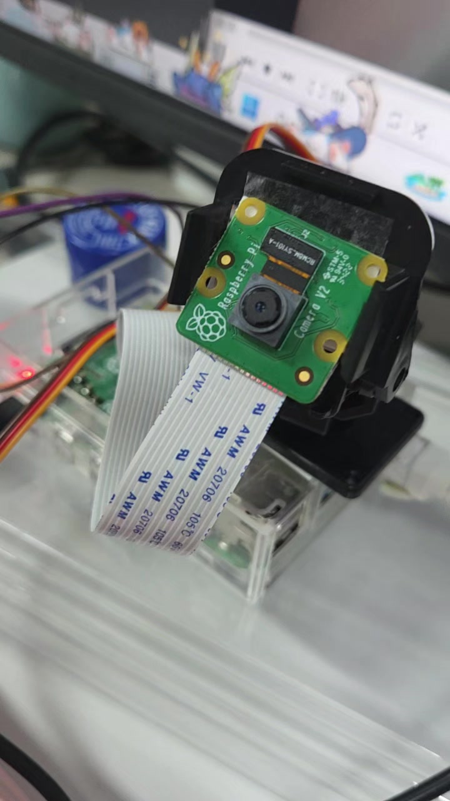
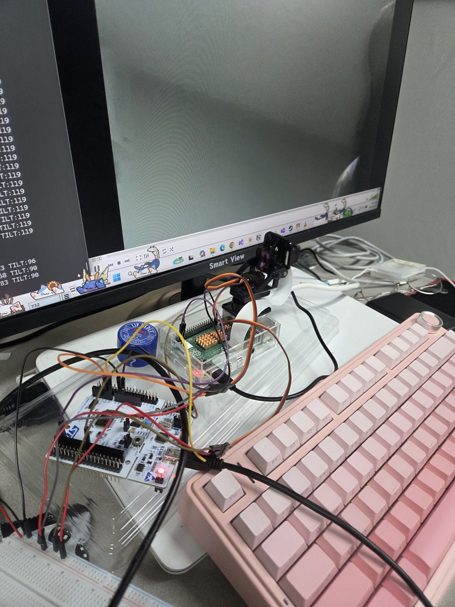

# ptz-stm32-firmware

STM32 2축 팬틸트 카메라 펌웨어 (한화비전 VEDA 4기 사이드 프로젝트)

라즈베리파이가 UART로 보낸 명령을 받아 팬·틸트 서보 2개를 PWM으로 구동하고, 현재 각도를 주기적으로 보고하는 펌웨어.

- 기간: 2026.05.18 ~ 2026.06.29
- 인원: 2인
- 담당: STM32 펌웨어. 라즈베리파이 쪽(카메라, RTSP 스트리밍, 명령 송신)은 팀원 담당이며 이 저장소에 포함하지 않음
- 프로젝트 종료 후 펌웨어 소스만 정리해 올린 저장소

| 완성본 | STM32 보드·서보 연결 |
|---|---|
|  |  |

## 시스템 구성

```
카메라    → 라즈베리파이 → RTSP 스트리밍
제어 명령 → 라즈베리파이 → UART → STM32 → PWM → 서보 2축
```

## 폴더 구조

```
Core/
├── Inc/   main.h, FreeRTOSConfig.h, stm32f4xx_hal_conf.h, stm32f4xx_it.h
└── Src/   main.c                         태스크 4개, 명령 파싱, 서보 제어
           stm32f4xx_hal_msp.c            TIM2, USART1 핀 설정
           stm32f4xx_it.c, freertos.c, stm32f4xx_hal_timebase_tim.c, system_stm32f4xx.c
docs/                                     사진
side_project_PTZ.ioc                      CubeMX 설정
```

`Drivers/`, `Middlewares/`, Keil 프로젝트 파일은 포함하지 않음. `.ioc`를 CubeMX에서 열어 코드 생성하면 만들어짐.

## 개발 환경

| 항목 | 내용 |
|---|---|
| 보드 | NUCLEO-F401RE (STM32F401RE) |
| 구동부 | SG90/MG90S 서보 2개, 2축 팬틸트 브래킷, 서보 전원 별도 공급 |
| 설정·코드 생성 | STM32CubeMX 6.7.0, STM32Cube FW_F4 V1.27.1, HAL |
| RTOS | FreeRTOS 10.3.1 (CMSIS-RTOS v2) |
| 빌드 | Keil MDK-ARM |
| 언어 | C |

## 핀 구성

| 핀 | 기능 | 용도 |
|---|---|---|
| PA0 | TIM2_CH1 | 팬 서보 PWM |
| PA1 | TIM2_CH2 | 틸트 서보 PWM |
| PA9 | USART1_TX | 라즈베리파이 연결 |
| PA10 | USART1_RX | 라즈베리파이 연결 |
| PC13 | B1 버튼 | 중앙 복귀 |

USART2(PA2/PA3)는 ST-Link 가상 COM 포트와 공유되므로 외부 장치 연결에는 USART1 사용.

## PWM 설정

- 타이머 클럭 84MHz, 프리스케일러 83 → 1MHz(1µs 단위)
- 주기 20,000카운트 → 20ms(50Hz)
- 각도 0\~180° → 펄스폭 500\~2500µs (`CCR = 500 + angle * 2000 / 180`)

## 태스크 구조

```
defaultTask (UART 수신) ─┐
                         ├─▶ cmdQueue (8칸) ─▶ motorTask ─▶ TIM2 PWM ─▶ 서보
buttonTask  (버튼 감시) ─┘

statusTask ─▶ UART 송신 (500ms마다 현재 각도)
```

| 태스크 | 주기 | 역할 |
|---|---|---|
| defaultTask | 상시 (1바이트 단위 수신) | 줄 단위 명령 파싱, 명령 큐 전달, 응답 송신 |
| motorTask | 20ms | 큐에서 명령을 꺼내 목표 각도 갱신, 현재 각도를 1°씩 목표로 이동 (초당 50°), 0~180° 제한 |
| statusTask | 500ms | 현재 각도 보고 |
| buttonTask | 50ms | 버튼 눌림 순간 감지, 중앙 복귀 명령을 큐에 전달 |

- 수신 태스크는 파싱과 응답만, 모터 태스크는 구동만 담당
- 큐 항목: `motor_cmd_t { type, value }`. 명령 종류 6가지(팬·틸트 절대 각도, 팬·틸트 상대 각도, 중앙, 정지)
- 전 태스크 우선순위 `osPriorityNormal`

## UART 명령

115200bps, 8N1. 한 줄에 명령 하나(CR 또는 LF로 종료). 수신 문자는 에코.

| 명령 | 동작 | 응답 |
|---|---|---|
| `LEFT` / `RIGHT` | 팬 -10° / +10° | `PAN -10` / `PAN +10` |
| `UP` / `DOWN` | 틸트 +10° / -10° | `TILT +10` / `TILT -10` |
| `PAN:<각도>` | 팬 절대 각도 이동 | `PAN to <각도>` |
| `TILT:<각도>` | 틸트 절대 각도 이동 | `TILT to <각도>` |
| `CENTER` | 양 축 90° | `Centered` |
| `STOP` | 현재 위치에서 정지 | `Stop` |
| `STATUS` | 현재 각도 조회 | `PAN:<각도> TILT:<각도>` |
| 그 외 | 무시 | `Unknown command: <입력>` |

- 부팅 시 양 축을 90°로 맞춘 뒤 `PTZ Ready` 송신
- 주기 보고: `[STATUS] PAN:<각도> TILT:<각도>`
- 버튼 입력 시: `[BUTTON] Center`

## 문제 해결

**FreeRTOS 전환 직후 일부 태스크 미실행**

- 증상: 베어메탈 구조를 4태스크와 명령 큐로 전환한 직후, 우선순위가 높은 태스크만 동작하고 낮은 태스크 미실행
- 원인: `HAL_UART_Receive`가 데이터를 기다리는 동안 CPU를 반납하지 않음. 우선순위가 낮은 태스크에 실행 시간이 돌아가지 않음
- 조치: 전 태스크 우선순위를 동일하게 맞춰 시분할 실행
- 결과: 4태스크 정상 동작, 라즈베리파이 연동까지 완료

## CubeMX 재생성 시 주의

- CubeMX 6.7.0에서 코드 생성 시 `main.c`의 큐·태스크 생성 호출(`osMessageQueueNew`, `osThreadNew`)이 지워짐. `osKernelInitialize()`와 `osKernelStart()` 사이에 직접 추가한 코드이므로 재생성 후 복구 필요
- `.ioc`에는 초기 설정(태스크 우선순위 차등, 큐 항목 `uint16_t`)이 남아 있음. 실제 동작 기준은 `main.c`(전 태스크 `osPriorityNormal`, 큐 항목 `motor_cmd_t`)
